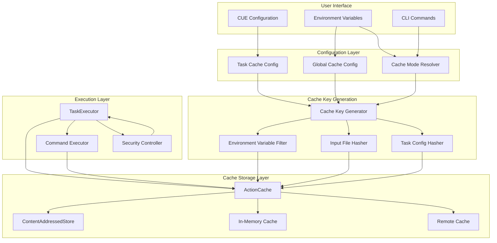
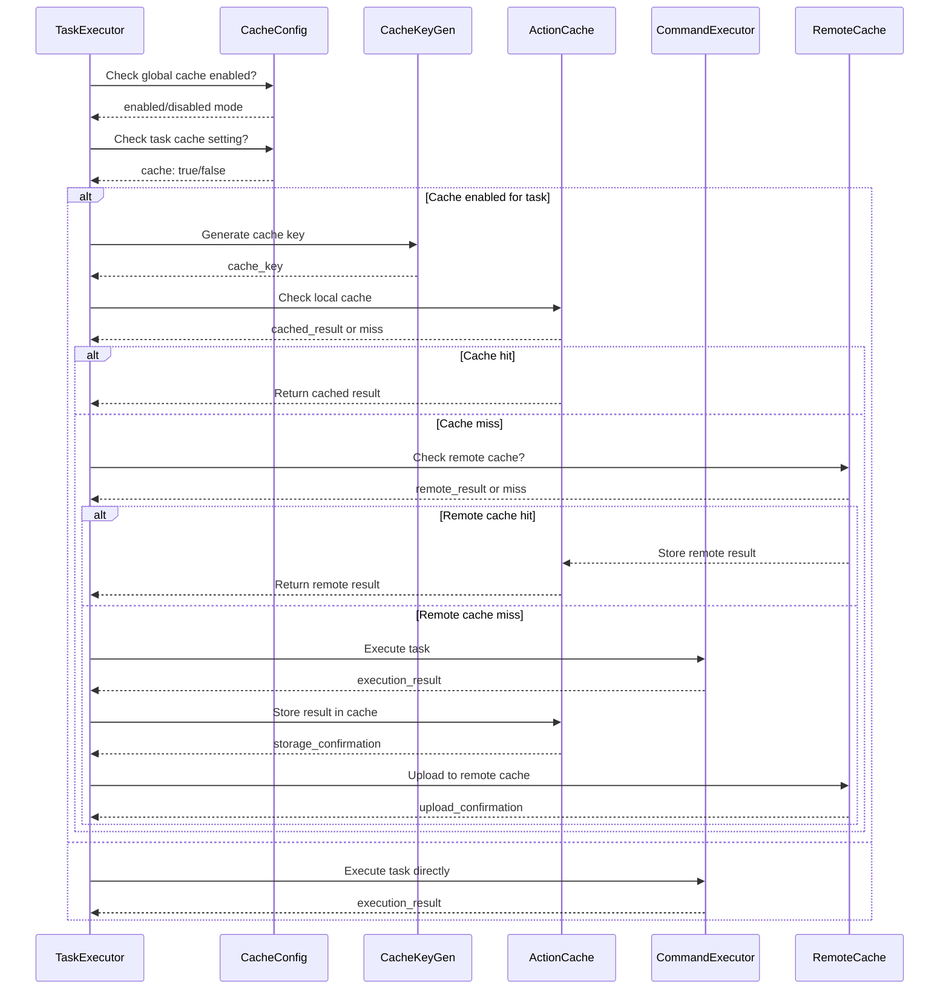

# Improved Cache Architecture Design for cuenv

## Executive Summary

This document outlines a comprehensive redesign of the cuenv cache system to create a Bazel-style build cache that works by default, can be disabled per task, uses persistent disk-based storage, and properly integrates with the existing sophisticated infrastructure (ActionCache, ContentAddressedStore, CacheSigner).

## Current Issues Analysis

### 1. Cache is Only In-Memory, Not Persistent

- **Problem**: The current `CacheManager` uses a simple `HashMap<String, CachedTaskResult>` for in-memory storage
- **Impact**: Cache is lost between cuenv invocations, eliminating the primary benefit of build caching
- **Root Cause**: `CacheManager::memory_cache` field is a simple in-memory HashMap

### 2. Task Executor Doesn't Check Task Config Cache Setting

- **Problem**: In `TaskExecutor::execute_single_task_with_cache()`, the method never checks `task_config.cache`
- **Impact**: All tasks are cached regardless of configuration, violating the principle of per-task control
- **Root Cause**: Missing conditional logic to check `task_config.cache.unwrap_or(true)` before caching

### 3. Cache Key Generation Includes ALL Environment Variables

- **Problem**: `CacheManager::generate_cache_key()` includes `std::env::vars().collect()` without filtering
- **Impact**: Cache keys change unnecessarily when unrelated environment variables change, reducing cache effectiveness
- **Root Cause**: No selective environment variable inclusion mechanism

### 4. Task Executor Bypasses ActionCache and ContentAddressedStore

- **Problem**: TaskExecutor uses `CacheManager`'s simple in-memory cache instead of the sophisticated `ActionCache`
- **Impact**: Loses benefits of content-addressed storage, cryptographic signing, and concurrent execution coordination
- **Root Cause**: `CacheManager` has both sophisticated components and a simple legacy interface

### 5. No Default Caching Behavior

- **Problem**: No global cache configuration system with sensible defaults
- **Impact**: Users must explicitly configure caching for each task
- **Root Cause**: Missing global cache configuration structure

## Design Requirements

### 1. Cache Configuration System

- **Global cache configuration** (enabled/disabled, cache directory, size limits)
- **Per-task cache override** (cache: true/false in CUE configuration)
- **Environment variable support** (CUENV_CACHE=off/read/read-write/write)
- **Remote cache configuration** (when available)

### 2. Cache Key Generation

- **Selective environment variable inclusion** (allowlist/denylist)
- **Input file hashing with glob pattern support**
- **Working directory normalization**
- **Task configuration hashing**
- **Command/script content hashing**

### 3. Cache Storage Architecture

- **Primary**: Local disk-based ContentAddressedStore
- **Fallback**: In-memory cache for small/fast operations
- **Remote**: gRPC-based remote cache server (when configured)
- **Persistent across cuenv invocations**

### 4. Cache Execution Flow

- **Check if caching is enabled** (global + per-task)
- **Generate cache key with selective inputs**
- **Check local cache (disk + memory)**
- **If miss, execute task and store results**
- **If remote cache configured, check/fetch from remote**

### 5. Integration Points

- **TaskExecutor must use ActionCache** instead of simple CacheManager
- **CacheManager should delegate to ActionCache** for actual operations
- **Maintain backward compatibility** with existing APIs
- **Preserve all existing security features** (cryptographic signing)

## Architecture Design

### System Architecture Diagram



### Cache Execution Flow



## Configuration Schema

### Global Cache Configuration

```rust
// src/cache/global_config.rs
#[derive(Debug, Clone, Serialize, Deserialize)]
pub struct GlobalCacheConfig {
    /// Enable/disable caching globally
    pub enabled: bool,
    /// Default cache mode for tasks without explicit setting
    pub default_mode: CacheMode,
    /// Cache directory path
    pub cache_dir: PathBuf,
    /// Maximum cache size in bytes
    pub max_size: u64,
    /// Environment variables to include in cache keys
    pub env_include: Option<Vec<String>>,
    /// Environment variables to exclude from cache keys
    pub env_exclude: Option<Vec<String>>,
    /// Remote cache configuration
    pub remote_cache: Option<RemoteCacheConfig>,
    /// Cache eviction policy
    pub eviction_policy: EvictionPolicy,
    /// Cache statistics retention
    pub stats_retention_days: u32,
}

#[derive(Debug, Clone, Serialize, Deserialize)]
pub struct RemoteCacheConfig {
    /// Remote cache server endpoint
    pub endpoint: String,
    /// Authentication token
    pub auth_token: Option<String>,
    /// Timeout for remote operations
    pub timeout_seconds: u32,
    /// Maximum concurrent remote requests
    pub max_concurrent: usize,
    /// Whether to upload results to remote cache
    pub upload_enabled: bool,
    /// Whether to download from remote cache
    pub download_enabled: bool,
}

#[derive(Debug, Clone, Serialize, Deserialize)]
pub enum EvictionPolicy {
    /// Least Recently Used
    LRU,
    /// Least Frequently Used
    LFU,
    /// First In First Out
    FIFO,
    /// Size-based eviction
    SizeBased,
}
```

### Enhanced Task Configuration

```rust
// src/cue_parser.rs (enhanced TaskConfig)
#[derive(Debug, Clone, Serialize, Deserialize)]
pub struct TaskConfig {
    // ... existing fields ...

    /// Enable build cache for this task (Bazel-style caching)
    pub cache: Option<bool>,
    /// Custom cache key - if not provided, will be derived from inputs
    #[serde(rename = "cacheKey")]
    pub cache_key: Option<String>,
    /// Cache-specific configuration
    pub cache_config: Option<TaskCacheConfig>,
    // ... existing fields ...
}

#[derive(Debug, Clone, Serialize, Deserialize)]
pub struct TaskCacheConfig {
    /// Override global environment variable inclusion
    pub env_include: Option<Vec<String>>,
    /// Override global environment variable exclusion
    pub env_exclude: Option<Vec<String>>,
    /// Additional input patterns for this task
    pub extra_inputs: Option<Vec<String>>,
    /// Files/directories that should not affect cache key
    pub ignore_inputs: Option<Vec<String>>,
    /// Custom cache key components
    pub custom_key_components: Option<HashMap<String, String>>,
}
```

## API Design

### Enhanced CacheManager API

```rust
// src/cache/enhanced_cache_manager.rs
pub struct EnhancedCacheManager {
    /// Global cache configuration
    global_config: GlobalCacheConfig,
    /// Action cache for sophisticated caching
    action_cache: Arc<ActionCache>,
    /// Content-addressed store
    content_store: Arc<ContentAddressedStore>,
    /// Remote cache client
    remote_cache: Option<Arc<RemoteCacheClient>>,
    /// Cache key generator
    key_generator: Arc<CacheKeyGenerator>,
    /// Cache statistics
    statistics: Arc<RwLock<CacheStatistics>>,
}

impl EnhancedCacheManager {
    /// Create new enhanced cache manager
    pub async fn new(global_config: GlobalCacheConfig) -> Result<Self>;

    /// Check if caching is enabled for a task
    pub fn is_caching_enabled(&self, task_config: &TaskConfig) -> bool;

    /// Get cache mode for a task
    pub fn get_task_cache_mode(&self, task_config: &TaskConfig) -> CacheMode;

    /// Execute task with caching
    pub async fn execute_task_with_cache(
        &self,
        task_name: &str,
        task_config: &TaskConfig,
        working_dir: &Path,
        env_vars: &HashMap<String, String>,
        execute_fn: impl FnOnce() -> Fut,
    ) -> Result<ActionResult>
    where
        Fut: Future<Output = Result<ActionResult>>;

    /// Generate cache key for task
    pub async fn generate_cache_key(
        &self,
        task_name: &str,
        task_config: &TaskConfig,
        working_dir: &Path,
        env_vars: &HashMap<String, String>,
    ) -> Result<ActionDigest>;

    /// Get cache statistics
    pub fn get_statistics(&self) -> CacheStatistics;

    /// Clear cache
    pub async fn clear_cache(&self) -> Result<()>;

    /// Cleanup stale entries
    pub async fn cleanup_stale_entries(&self) -> Result<(usize, u64)>;
}
```

### Cache Key Generator API

```rust
// src/cache/key_generator.rs
pub struct CacheKeyGenerator {
    /// Global environment include patterns
    global_env_include: Option<Vec<String>>,
    /// Global environment exclude patterns
    global_env_exclude: Option<Vec<String>>,
    /// Default input patterns
    default_inputs: Vec<String>,
    /// Hash engine for file hashing
    hash_engine: Arc<HashEngine>,
}

impl CacheKeyGenerator {
    /// Create new cache key generator
    pub fn new(
        global_env_include: Option<Vec<String>>,
        global_env_exclude: Option<Vec<String>>,
    ) -> Self;

    /// Generate action digest for task
    pub async fn generate_action_digest(
        &self,
        task_name: &str,
        task_config: &TaskConfig,
        working_dir: &Path,
        env_vars: &HashMap<String, String>,
    ) -> Result<ActionDigest>;

    /// Filter environment variables for cache key
    pub fn filter_environment_variables(
        &self,
        env_vars: &HashMap<String, String>,
        task_config: &TaskConfig,
    ) -> HashMap<String, String>;

    /// Hash input files based on patterns
    pub async fn hash_input_files(
        &self,
        patterns: &[String],
        working_dir: &Path,
    ) -> Result<HashMap<String, String>>;

    /// Normalize working directory path
    pub fn normalize_working_directory(&self, path: &Path) -> Result<PathBuf>;
}
```

### Remote Cache Client API

```rust
// src/remote_cache/client.rs
pub struct RemoteCacheClient {
    /// Remote cache configuration
    config: RemoteCacheConfig,
    /// gRPC client
    grpc_client: Arc<CacheServiceClient<Channel>>,
    /// Request semaphore for concurrency control
    request_semaphore: Arc<Semaphore>,
}

impl RemoteCacheClient {
    /// Create new remote cache client
    pub async fn new(config: RemoteCacheConfig) -> Result<Self>;

    /// Check if action result exists in remote cache
    pub async fn has_action_result(&self, digest: &ActionDigest) -> Result<bool>;

    /// Get action result from remote cache
    pub async fn get_action_result(&self, digest: &ActionDigest) -> Result<ActionResult>;

    /// Upload action result to remote cache
    pub async fn upload_action_result(
        &self,
        digest: &ActionDigest,
        result: &ActionResult,
    ) -> Result<()>;

    /// Check if content exists in remote cache
    pub async fn has_content(&self, hash: &str) -> Result<bool>;

    /// Get content from remote cache
    pub async fn get_content(&self, hash: &str) -> Result<Vec<u8>>;

    /// Upload content to remote cache
    pub async fn upload_content(&self, hash: &str, content: &[u8]) -> Result<()>;
}
```

## Migration Plan

### Phase 1: Infrastructure Preparation (Week 1-2)

1. **Create Enhanced Configuration Types**

   - Implement `GlobalCacheConfig` and related types
   - Add configuration file support (JSON/YAML)
   - Environment variable parsing for global settings

2. **Enhance TaskConfig Structure**

   - Add `cache_config` field to `TaskConfig`
   - Update CUE schema to support new cache configuration
   - Maintain backward compatibility with existing `cache: bool` field

3. **Create Cache Key Generator**
   - Implement selective environment variable filtering
   - Add input file hashing with glob support
   - Implement working directory normalization

### Phase 2: Core Implementation (Week 3-4)

1. **Enhanced CacheManager**

   - Create `EnhancedCacheManager` with proper ActionCache integration
   - Implement persistent storage delegation
   - Add remote cache integration points

2. **TaskExecutor Integration**

   - Modify `execute_single_task_with_cache` to check task config
   - Integrate with ActionCache instead of simple cache
   - Add proper cache key generation

3. **Remote Cache Client**
   - Implement gRPC client for remote cache
   - Add authentication and error handling
   - Implement concurrency control

### Phase 3: Testing and Validation (Week 5)

1. **Unit Tests**

   - Test cache key generation with various inputs
   - Test environment variable filtering
   - Test configuration parsing and validation

2. **Integration Tests**

   - Test end-to-end caching with real tasks
   - Test remote cache integration
   - Test concurrent execution scenarios

3. **Performance Tests**
   - Benchmark cache key generation
   - Test cache hit/miss performance
   - Measure overhead of new caching system

### Phase 4: Migration and Deployment (Week 6)

1. **Backward Compatibility**

   - Ensure existing cache APIs still work
   - Provide migration guide for users
   - Add deprecation warnings for old APIs

2. **Documentation**

   - Update user documentation
   - Create migration guide
   - Add examples of new cache configuration

3. **Rollout Strategy**
   - Feature flag for new cache system
   - Gradual rollout with monitoring
   - Fallback to old system if issues arise

## Implementation Strategy

### Key Implementation Principles

1. **Leverage Existing Infrastructure**

   - Use existing `ActionCache` as the primary caching mechanism
   - Utilize `ContentAddressedStore` for persistent storage
   - Maintain `CacheSigner` for security

2. **Incremental Changes**

   - Implement new features without breaking existing functionality
   - Use feature flags for gradual rollout
   - Provide clear migration paths

3. **Performance Considerations**

   - Minimize overhead for cache-disabled scenarios
   - Use async/await for non-blocking operations
   - Implement proper concurrency control

4. **Security and Reliability**
   - Maintain cryptographic signing of cache entries
   - Implement proper error handling and recovery
   - Add comprehensive logging and monitoring

### Critical Success Factors

1. **Backward Compatibility**

   - Existing CUE files must continue to work
   - Existing cache APIs must remain functional
   - No breaking changes to user experience

2. **Performance**

   - Cache operations must not significantly slow down task execution
   - Cache key generation must be efficient
   - Remote cache operations must be non-blocking

3. **Reliability**

   - Cache system must be resilient to failures
   - Graceful degradation when remote cache is unavailable
   - Proper cleanup and maintenance of cache storage

4. **Usability**
   - Sensible defaults for cache configuration
   - Clear error messages and diagnostics
   - Easy configuration and management

## Testing Strategy

### Test Categories

1. **Unit Tests**

   - Configuration parsing and validation
   - Cache key generation algorithms
   - Environment variable filtering
   - Input file hashing

2. **Integration Tests**

   - End-to-end caching with real tasks
   - Remote cache integration
   - Concurrent execution scenarios
   - Cache persistence across invocations

3. **Performance Tests**

   - Cache key generation performance
   - Cache hit/miss latency
   - Remote cache bandwidth usage
   - Storage usage and cleanup

4. **Compatibility Tests**
   - Backward compatibility with existing CUE files
   - Existing API compatibility
   - Migration path validation

### Test Environment Setup

1. **Local Testing**

   - Unit tests with mock dependencies
   - Integration tests with temporary directories
   - Performance tests with realistic workloads

2. **Remote Cache Testing**

   - Mock remote cache server
   - Real remote cache integration tests
   - Network failure simulation

3. **Real-world Scenarios**
   - Large codebase simulation
   - Concurrent task execution
   - Mixed cache-enabled/disabled tasks

## Monitoring and Observability

### Metrics to Track

1. **Cache Performance**

   - Cache hit rate
   - Cache miss rate
   - Average cache lookup time
   - Average cache storage time

2. **Resource Usage**
   - Disk space usage
   - Memory usage
