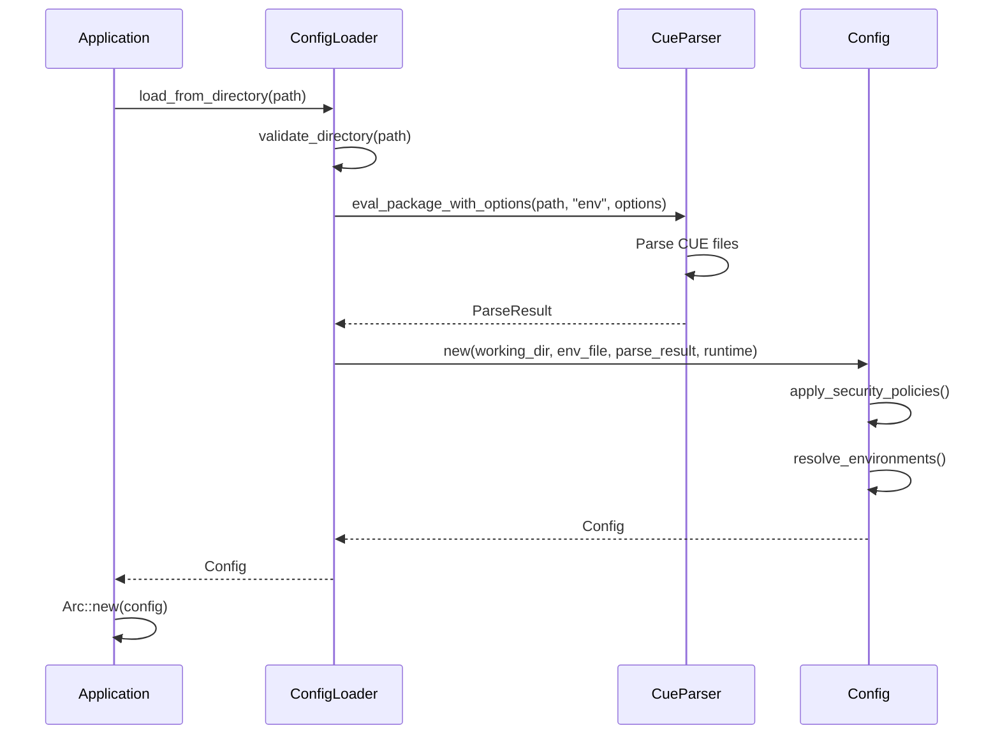

# Configuration API

This document covers cuenv's centralized configuration API, built around the `Config` struct and `Arc<Config>` sharing pattern for optimal performance and memory efficiency.

## Overview

cuenv's configuration system is designed around a single source of truth pattern:

1. **ConfigLoader** - Loads and validates configuration from CUE files
2. **Config** - Immutable configuration data structure  
3. **Arc<Config>** - Thread-safe shared reference for zero-copy access

## ConfigLoader

The entry point for loading configuration data.

### Basic Usage

```rust
use cuenv_config::{ConfigLoader, Config};
use std::path::PathBuf;
use std::sync::Arc;

// Load configuration from directory
let config_loader = ConfigLoader::new();
let config = config_loader.load_from_directory(&PathBuf::from("."))?;
let shared_config = Arc::new(config);

// Pass to components that need configuration
command.execute(Arc::clone(&shared_config)).await?;
```

### ConfigLoader Methods

```rust
impl ConfigLoader {
    /// Create a new configuration loader
    pub fn new() -> Self
    
    /// Load configuration from a directory containing env.cue
    pub fn load_from_directory(&self, dir: &Path) -> Result<Config>
    
    /// Load with specific runtime options
    pub fn load_with_options(
        &self, 
        dir: &Path, 
        runtime: RuntimeOptions
    ) -> Result<Config>
}
```

### Runtime Options

```rust
use cuenv_config::RuntimeOptions;

let runtime = RuntimeOptions {
    environment: Some("production".to_string()),
    capabilities: vec!["aws".to_string(), "database".to_string()],
    audit_mode: false,
    cache_mode: Some("local".to_string()),
    cache_enabled: true,
};

let config = config_loader.load_with_options(&dir, runtime)?;
```

## Config Struct

The core configuration data structure containing all parsed CUE data.

### Creation

```rust
use cuenv_config::{Config, ParseResult, RuntimeOptions};

// Direct creation (typically done by ConfigLoader)
let config = Config::new(
    working_dir,
    env_file_path,
    parse_result,
    runtime_options
);
```

### Accessor Methods

```rust
impl Config {
    /// Get all tasks defined in the configuration
    pub fn get_tasks(&self) -> &HashMap<String, TaskConfig>
    
    /// Get all environment variables
    pub fn get_env_vars(&self) -> &HashMap<String, String>
    
    /// Get variable metadata (descriptions, sensitivity, etc.)
    pub fn get_metadata(&self) -> &HashMap<String, VariableMetadata>
    
    /// Get command definitions
    pub fn get_commands(&self) -> &HashMap<String, CommandConfig>
    
    /// Get hooks configuration
    pub fn get_hooks(&self) -> &HashMap<String, Vec<Hook>>
    
    /// Check if a variable is marked as sensitive
    pub fn is_sensitive(&self, var_name: &str) -> bool
    
    /// Get working directory
    pub fn get_working_dir(&self) -> &Path
    
    /// Get environment file path (if any)
    pub fn get_env_file(&self) -> Option<&Path>
    
    /// Get runtime options
    pub fn get_runtime(&self) -> &RuntimeOptions
}
```

## Arc<Config> Pattern

The recommended pattern for sharing configuration across components.

### Benefits

- **Zero-copy sharing**: Multiple references to the same data
- **Thread-safe**: Can be safely shared across threads
- **Memory efficient**: Single allocation for all components
- **Immutable**: Configuration cannot be accidentally modified

### Usage Examples

```rust
use std::sync::Arc;

// Create shared configuration
let config = Arc::new(loaded_config);

// Clone Arc (cheap - only increments reference count)
let config_for_task = Arc::clone(&config);
let config_for_mcp = Arc::clone(&config);

// Pass to different components
tokio::spawn(async move {
    task_executor.execute(config_for_task).await
});

mcp_server.start(config_for_mcp).await?;
```

### Thread Safety

```rust
use std::sync::Arc;
use tokio::task;

async fn concurrent_access(config: Arc<Config>) {
    let handles = (0..10).map(|i| {
        let config = Arc::clone(&config);
        task::spawn(async move {
            // Each task can safely access the same configuration
            let tasks = config.get_tasks();
            println!("Task {}: found {} tasks", i, tasks.len());
        })
    });
    
    // Wait for all tasks to complete
    for handle in handles {
        handle.await.unwrap();
    }
}
```

## Data Structures

### TaskConfig

```rust
use cuenv_config::TaskConfig;

pub struct TaskConfig {
    pub description: Option<String>,
    pub command: Option<String>,
    pub script: Option<String>,
    pub shell: Option<String>,
    pub dependencies: Option<Vec<String>>,
    pub working_dir: Option<PathBuf>,
    pub env: Option<HashMap<String, String>>,
    pub capabilities: Option<Vec<String>>,
    pub cache: Option<TaskCacheConfig>,
}

// Access task configuration
let tasks = config.get_tasks();
if let Some(build_task) = tasks.get("build") {
    println!("Build command: {:?}", build_task.command);
    println!("Dependencies: {:?}", build_task.dependencies);
}
```

### VariableMetadata

```rust
use cuenv_config::VariableMetadata;

pub struct VariableMetadata {
    pub description: Option<String>,
    pub sensitive: bool,
    pub required: bool,
    pub default_value: Option<String>,
    pub validation: Option<ValidationRule>,
}

// Check variable metadata
let metadata = config.get_metadata();
if let Some(api_key_meta) = metadata.get("API_KEY") {
    if api_key_meta.sensitive {
        println!("API_KEY is marked as sensitive");
    }
}
```

### CommandConfig

```rust
use cuenv_config::CommandConfig;

pub struct CommandConfig {
    pub description: Option<String>,
    pub capabilities: Vec<String>,
}

// Access command configuration
let commands = config.get_commands();
if let Some(terraform_cmd) = commands.get("terraform") {
    println!("Terraform capabilities: {:?}", terraform_cmd.capabilities);
}
```

## Configuration Loading Process

### Step-by-Step Process



### Error Handling

```rust
use cuenv_core::{Error, Result};

// Configuration loading can fail at multiple stages
match config_loader.load_from_directory(&dir) {
    Ok(config) => {
        let shared_config = Arc::new(config);
        // Use configuration...
    }
    Err(Error::CueValidation(msg)) => {
        eprintln!("CUE validation error: {}", msg);
    }
    Err(Error::FileSystem(path, op, io_err)) => {
        eprintln!("File system error: {} while {} on {}", io_err, op, path.display());
    }
    Err(Error::Configuration(msg)) => {
        eprintln!("Configuration error: {}", msg);
    }
    Err(e) => {
        eprintln!("Unexpected error: {}", e);
    }
}
```

## Caching and Performance

### Configuration Caching

```rust
use cuenv_config::ConfigCache;

// Optional: Enable configuration caching for repeated loads
let cache = ConfigCache::new();
let config = cache.get_or_load(&dir, &runtime_options)?;
```

### Performance Characteristics

| Operation | Time Complexity | Memory Usage |
|-----------|----------------|--------------|
| `load_from_directory` | O(n) where n = CUE file size | O(n) |
| `get_tasks` | O(1) | O(1) |
| `get_env_vars` | O(1) | O(1) |
| `Arc::clone` | O(1) | O(1) |
| `is_sensitive` | O(1) | O(1) |

### Memory Efficiency

```rust
// BAD: Multiple copies of the same data
let config1 = load_config(&dir)?; // Copy 1
let config2 = load_config(&dir)?; // Copy 2  
let config3 = load_config(&dir)?; // Copy 3

// GOOD: Single shared instance
let config = Arc::new(load_config(&dir)?);
let config1 = Arc::clone(&config); // Shared reference
let config2 = Arc::clone(&config); // Shared reference  
let config3 = Arc::clone(&config); // Shared reference
```

## Advanced Usage

### Custom Configuration Sources

```rust
impl ConfigLoader {
    /// Load from custom source (e.g., remote, database)
    pub fn load_from_source<S>(&self, source: S) -> Result<Config>
    where
        S: ConfigSource,
    {
        let parse_result = source.parse()?;
        Ok(Config::new(
            source.working_dir(),
            source.env_file(),
            parse_result,
            self.runtime_options.clone()
        ))
    }
}
```

### Configuration Validation

```rust
impl Config {
    /// Validate configuration against schema
    pub fn validate(&self) -> Result<()> {
        // Check required variables
        for (name, metadata) in self.get_metadata() {
            if metadata.required && !self.get_env_vars().contains_key(name) {
                return Err(Error::configuration(
                    format!("Required variable '{}' is missing", name)
                ));
            }
        }
        
        // Validate task dependencies
        self.validate_task_dependencies()?;
        
        Ok(())
    }
}
```

### Environment Resolution

```rust
// Configuration supports environment-specific overrides
let runtime = RuntimeOptions {
    environment: Some("production".to_string()),
    ..Default::default()
};

let config = config_loader.load_with_options(&dir, runtime)?;

// Environment-specific values are automatically resolved
let port = config.get_env_vars().get("PORT"); // Gets production port
```

## Integration Examples

### Command Integration

```rust
use cuenv_config::Config;
use std::sync::Arc;

struct CustomCommand {
    config: Arc<Config>,
}

impl CustomCommand {
    pub fn new(config: Arc<Config>) -> Self {
        Self { config }
    }
    
    pub async fn execute(&self) -> Result<()> {
        let tasks = self.config.get_tasks();
        let env_vars = self.config.get_env_vars();
        
        // Use configuration data...
        
        Ok(())
    }
}
```

### Service Integration

```rust
struct ConfigService {
    config: Arc<Config>,
}

impl ConfigService {
    pub fn new(config: Arc<Config>) -> Self {
        Self { config }
    }
    
    pub fn get_task_info(&self, task_name: &str) -> Option<TaskInfo> {
        let tasks = self.config.get_tasks();
        tasks.get(task_name).map(|task| TaskInfo {
            name: task_name.to_string(),
            description: task.description.clone().unwrap_or_default(),
            command: task.command.clone().unwrap_or_default(),
        })
    }
}
```

## Migration Guide

### From Direct CUE Parsing

```rust
// OLD: Direct parsing in each component
use cuenv_config::{CueParser, ParseOptions};

let options = ParseOptions::default();
let parse_result = CueParser::eval_package(&dir, "env", &options)?;
let tasks = parse_result.tasks;

// NEW: Use shared Arc<Config>
use std::sync::Arc;

let config = Arc::new(config_loader.load_from_directory(&dir)?);
let tasks = config.get_tasks();
```

### From Static Configuration

```rust
// OLD: Static HashMap
let mut tasks = HashMap::new();
tasks.insert("build".to_string(), build_task_config);

// NEW: Configuration from CUE files  
let config = Arc::new(config_loader.load_from_directory(&dir)?);
let tasks = config.get_tasks(); // Dynamic from CUE files
```

## Best Practices

1. **Always use Arc<Config>** for sharing configuration
2. **Load once, share everywhere** - avoid redundant loading
3. **Prefer immutable access** - use getter methods, don't modify
4. **Handle errors appropriately** - configuration loading can fail
5. **Use caching for repeated loads** in long-running applications
6. **Validate configuration early** in application startup