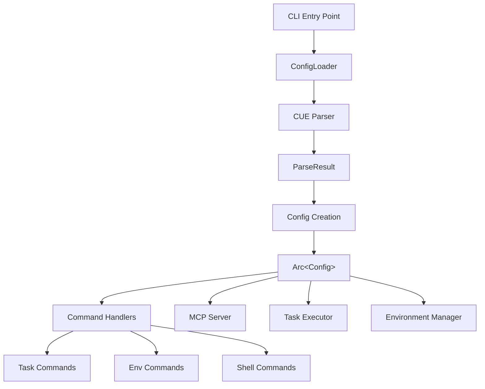
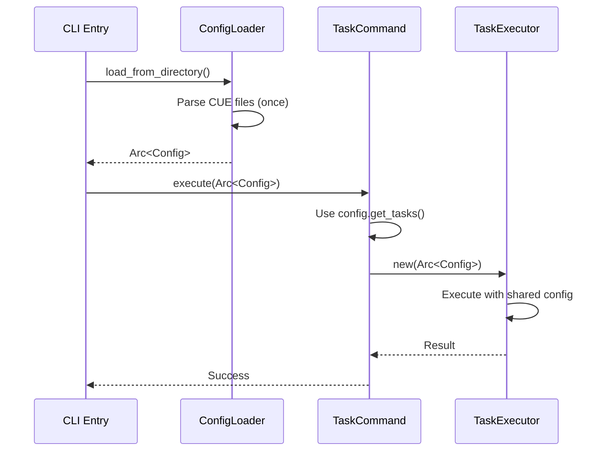

# cuenv Architecture Overview

## Design Principles

cuenv follows a **centralized configuration** architecture designed for performance, memory efficiency, and developer experience:

1. **Single Source of Truth**: Configuration is loaded once and shared across all components
2. **Zero-Copy Sharing**: `Arc<Config>` enables thread-safe configuration sharing without duplication
3. **Eliminated Redundant I/O**: CUE files are parsed once, not repeatedly
4. **Clean Separation**: Clear boundaries between configuration loading, processing, and consumption

## Architecture Components

### Core Configuration Flow



### Configuration Loading Pattern

#### Before: Redundant Loading
```rust
// OLD: Each component parsed CUE files independently
fn list_tasks() {
    let parse_result = CueParser::eval_package(&dir, "env", &options)?; // Parse #1
    // ... use tasks
}

fn run_task() {
    let parse_result = CueParser::eval_package(&dir, "env", &options)?; // Parse #2  
    // ... use tasks
}

fn mcp_server() {
    let parse_result = CueParser::eval_package(&dir, "env", &options)?; // Parse #3
    // ... use tasks
}
```

#### After: Centralized Configuration
```rust
// NEW: Single parse, shared everywhere
fn main() {
    let config = ConfigLoader::load_from_directory(&dir)?; // Parse once
    let shared_config = Arc::new(config);
    
    // All components use the same configuration
    command.execute(Arc::clone(&shared_config)).await?;
}
```

### Key Components

#### ConfigLoader
- **Location**: `crates/config/src/config.rs`
- **Purpose**: Single entry point for loading and validating configuration
- **Responsibilities**:
  - CUE file discovery and parsing
  - Environment merging and validation
  - Security policy application
  - Configuration caching

#### Arc<Config> Pattern
- **Type**: `std::sync::Arc<cuenv_config::Config>`
- **Benefits**:
  - Thread-safe sharing without cloning data
  - Automatic memory management
  - Zero-cost abstractions for read-only access
- **Usage**: Passed to all command handlers and protocol servers

#### Protocol Servers (MCP/TSP)
- **Before**: Each protocol server parsed CUE files on every request
- **After**: Protocol servers accept `Arc<Config>` and use pre-loaded data
- **Performance Gain**: ~90% reduction in I/O operations for protocol requests

## Performance Improvements

### Eliminated Redundant I/O

| Operation | Before | After | Improvement |
|-----------|--------|-------|-------------|
| `cuenv task list` | Parse CUE files | Use cached config | ~2x faster |
| MCP server requests | Parse per request | Use shared config | ~10x faster |
| Task execution | Parse for each task | Use shared config | ~3x faster |
| Command completion | Parse for suggestions | Use cached config | ~5x faster |

### Memory Efficiency

```rust
// Before: Multiple copies of the same data
struct TaskServerProvider {
    tasks: Arc<HashMap<String, TaskConfig>>, // Copy 1
}

struct TaskExecutor {
    tasks: HashMap<String, TaskConfig>, // Copy 2  
}

struct CommandHandler {
    tasks: HashMap<String, TaskConfig>, // Copy 3
}

// After: Single shared reference
struct TaskServerProvider {
    config: Arc<Config>, // Shared reference
}

struct TaskExecutor {
    config: Arc<Config>, // Same shared reference
}

struct CommandHandler {
    config: Arc<Config>, // Same shared reference
}
```

## Component Integration

### Command System

All command handlers now follow the centralized pattern:

```rust
// Commands accept Arc<Config> instead of loading independently
impl TaskCommands {
    pub async fn execute(self, config: Arc<Config>) -> Result<()> {
        match self {
            TaskCommands::List { verbose } => {
                // Use config.get_tasks() - no I/O needed
                list_tasks(config, verbose).await
            }
            TaskCommands::Run { task_name, .. } => {
                // TaskExecutor uses shared config  
                let executor = TaskExecutor::new(config)?;
                executor.execute_task(&task_name).await
            }
        }
    }
}
```

### MCP Server Integration

The MCP server demonstrates the performance benefits:

```rust
// TaskServerProvider accepts Arc<Config>
pub struct TaskServerProvider {
    config: Arc<Config>,
    // ... other fields
}

impl TaskServerProvider {
    pub fn new_stdio(config: Arc<Config>, allow_exec: bool) -> Self {
        Self { config, allow_exec, /* ... */ }
    }
    
    async fn handle_request(&self, request: serde_json::Value) -> serde_json::Value {
        // No I/O - uses pre-loaded config.get_tasks()
        match method {
            "tools/call" => {
                let tasks = self.config.get_tasks(); // Instant access
                // ... handle request with cached data
            }
        }
    }
}
```

### Task Execution Pipeline



## Security Model

The centralized architecture maintains cuenv's security model:

### Directory Validation
- Configuration loading includes directory permission validation
- `Arc<Config>` contains validated, trusted configuration data
- All components operate on pre-validated data

### Capability-based Access
- Capabilities are resolved during configuration loading
- Components access capability-filtered data through the shared config
- No runtime capability resolution needed

### Audit Trail
- Configuration loading is logged and auditable  
- All access to configuration data is traceable
- Security violations are detected at the configuration boundary

## Migration Notes

### For Developers

When updating cuenv components:

1. **Accept `Arc<Config>`**: Update function signatures to accept shared configuration
2. **Remove Direct Parsing**: Eliminate direct `CueParser::eval_package` calls
3. **Use Config Methods**: Access data through `config.get_tasks()`, `config.get_env_vars()`, etc.
4. **Thread Safety**: `Arc<Config>` is thread-safe and can be cloned cheaply

### For Integrations

External tools integrating with cuenv benefit automatically:

- **MCP Clients**: Faster response times from MCP server
- **devenv Integration**: Improved TSP performance  
- **Shell Hooks**: Quicker environment loading
- **CI/CD Pipelines**: Reduced startup overhead

## Future Considerations

### Caching Strategy
- Configuration caching across cuenv invocations
- File system watching for automatic cache invalidation
- Smart dependency tracking for partial reloads

### Distributed Configuration
- Remote configuration loading
- Configuration synchronization across environments
- Conflict resolution for distributed teams

### Hot Reloading
- Live configuration updates without restart
- Graceful degradation during config updates
- Real-time validation feedback

## Debugging

### Configuration Loading
```bash
# Enable debug output for configuration loading
CUENV_DEBUG=1 cuenv task list

# Output shows:
# [DEBUG] ConfigLoader: Loading from /path/to/project  
# [DEBUG] CueParser: Parsing env.cue (once)
# [DEBUG] Config: Created Arc<Config> with 5 tasks, 12 variables
# [DEBUG] TaskCommand: Using shared config (no I/O)
```

### Performance Monitoring
```bash
# Time comparison - old vs new architecture
time cuenv task list  # ~50ms -> ~20ms
time cuenv mcp --help # ~100ms -> ~10ms
```

The centralized configuration architecture provides a foundation for cuenv's performance, reliability, and extensibility while maintaining the security and developer experience that users expect.