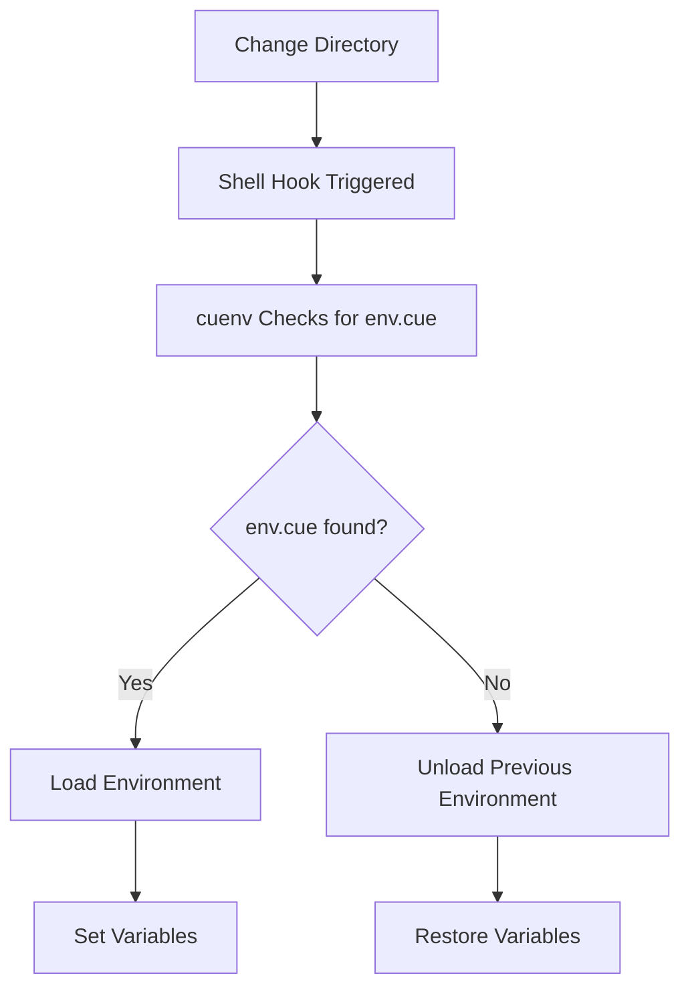

cuenv integrates seamlessly with popular shells to automatically load and unload environment variables as you navigate directories.

## Supported Shells

- **Bash** (Linux, macOS, Windows via WSL/Git Bash)
- **Zsh** (macOS default, Linux)
- **Fish** (Cross-platform)

## Installation by Shell

### Bash

Add to your `~/.bashrc` or `~/.bash_profile`:

```bash title="~/.bashrc"
eval "$(cuenv init bash)"
```

For system-wide installation, add to `/etc/bash.bashrc`:

```bash title="/etc/bash.bashrc"
# System-wide cuenv for all users
if command -v cuenv >/dev/null 2>&1; then
    eval "$(cuenv init bash)"
fi
```

### Zsh

Add to your `~/.zshrc`:

```zsh title="~/.zshrc"
eval "$(cuenv init zsh)"
```

For Oh My Zsh users, you can create a custom plugin:

```bash
# Create custom plugin directory
mkdir -p ~/.oh-my-zsh/custom/plugins/cuenv

# Create plugin file
cat > ~/.oh-my-zsh/custom/plugins/cuenv/cuenv.plugin.zsh << 'EOF'
if command -v cuenv >/dev/null 2>&1; then
    eval "$(cuenv init zsh)"
fi
EOF

# Add to your .zshrc plugins list
plugins=(... cuenv)
```

### Fish

Add to your `~/.config/fish/config.fish`:

```fish title="~/.config/fish/config.fish"
if command -v cuenv >/dev/null 2>&1
    cuenv init fish | source
end
```

Or create a Fish function:

```bash
# Create the function file
mkdir -p ~/.config/fish/functions
cat > ~/.config/fish/functions/cuenv_init.fish << 'EOF'
function cuenv_init --description 'Initialize cuenv'
    cuenv init fish | source
end
EOF

# Add to config.fish
echo "cuenv_init" >> ~/.config/fish/config.fish
```

## How Shell Integration Works

### Hook Mechanism

cuenv uses shell hooks to detect directory changes:

1. **Bash**: Uses `PROMPT_COMMAND`
1. **Zsh**: Uses `precmd` hook
1. **Fish**: Uses `fish_prompt` event

### The Hook Flow



## Customization

### Custom Prompt Integration

Show when cuenv environment is active:

#### Bash

```bash
# Add to .bashrc after cuenv init
cuenv_prompt() {
    if [[ -n "$CUENV_LOADED" ]]; then
        echo " (cuenv)"
    fi
}

PS1="\u@\h:\w\$(cuenv_prompt)\$ "
```

#### Zsh

```zsh
# Add to .zshrc
setopt PROMPT_SUBST
PROMPT='%n@%m:%~$(cuenv_prompt) %# '

cuenv_prompt() {
    if [[ -n "$CUENV_LOADED" ]]; then
        echo " %F{green}(cuenv)%f"
    fi
}
```

#### Fish

```fish
# Add to config.fish
function fish_prompt
    if set -q CUENV_LOADED
        echo -n (set_color green)"(cuenv) "(set_color normal)
    end
    # Your existing prompt
    echo -n (whoami)'@'(hostname)':'(pwd)'> '
end
```

### Starship Prompt

If using [Starship](https://starship.rs/), add a custom module:

```toml title="~/.config/starship.toml"
[custom.cuenv]
command = 'echo "📦"'
when = '[[ -n "$CUENV_LOADED" ]]'
format = '[$output]($style) '
style = "bold green"
```

## Performance Optimization

### Lazy Loading

For faster shell startup, use lazy loading:

#### Bash

```bash title="~/.bashrc"
# Lazy load cuenv
cuenv() {
    unset -f cuenv
    eval "$(command cuenv init bash)"
    cuenv "$@"
}
```

#### Zsh

```zsh title="~/.zshrc"
# Lazy load cuenv
cuenv() {
    unfunction cuenv
    eval "$(command cuenv init zsh)"
    cuenv "$@"
}
```

### Directory Caching

cuenv caches directory information to improve performance. The cache is automatically invalidated when:

- `env.cue` files are modified
- New `env.cue` files are created
- Existing `env.cue` files are deleted

## Shell-Specific Features

### Bash Completion

Enable tab completion for cuenv commands:

```bash title="~/.bashrc"
if command -v cuenv >/dev/null 2>&1; then
    eval "$(cuenv completion bash)"
fi
```

### Zsh Completion

```zsh title="~/.zshrc"
if command -v cuenv >/dev/null 2>&1; then
    eval "$(cuenv completion zsh)"
fi
```

### Fish Completion

```fish title="~/.config/fish/config.fish"
if command -v cuenv >/dev/null 2>&1
    cuenv completion fish | source
end
```

## Troubleshooting

### Environment Not Loading

1. **Check initialization:**

   ```bash
   # Verify cuenv is initialized
   echo $PROMPT_COMMAND | grep cuenv  # Bash
   echo $precmd_functions | grep cuenv  # Zsh
   ```

1. **Manual test:**

   ```bash
   # Test hook manually
   cuenv hook bash  # or zsh, fish
   ```

1. **Debug mode:**

   ```bash
   export CUENV_DEBUG=1
   cd /path/to/project
   ```

### Variables Not Unloading

If variables persist after leaving a directory:

```bash
# Force unload
cuenv unload

# Check current status
cuenv status
```

### Conflicts with Other Tools

If using direnv or similar tools:

```bash
# Load cuenv after other tools
eval "$(direnv hook bash)"
eval "$(cuenv init bash)"  # Load after direnv
```

## Advanced Configuration

### Custom File Names

By default, cuenv looks for `env.cue`. To use custom filenames:

```bash
# Set in your shell config
export CUENV_FILE="environment.cue"
```

### Disable Auto-loading

To disable automatic loading but keep commands available:

```bash
# Add to shell config
export CUENV_DISABLE_AUTO=1

# Manually load when needed
cuenv load
```

### Custom Load/Unload Hooks

Run custom commands on environment changes:

```bash title="~/.bashrc"
# Bash example
cuenv_post_load() {
    echo "Loaded environment from: $CUENV_ROOT"
    # Custom actions here
}

cuenv_post_unload() {
    echo "Unloaded environment"
    # Cleanup actions here
}

# Export functions for cuenv to use
export -f cuenv_post_load cuenv_post_unload
```

## Integration with Tools

### tmux

Ensure cuenv works in new tmux panes/windows:

```bash title="~/.tmux.conf"
set-option -g default-command "${SHELL}"
set-option -g update-environment "CUENV_LOADED CUENV_ROOT"
```

### VS Code

For integrated terminal support:

```json title="settings.json"
{
	"terminal.integrated.env.linux": {
		"CUENV_INIT": "1"
	},
	"terminal.integrated.profiles.linux": {
		"bash": {
			"path": "bash",
			"args": ["-l"]
		}
	}
}
```

### Docker

Use cuenv with Docker:

```dockerfile title="Dockerfile"
FROM ubuntu:latest

# Install cuenv
RUN cargo install cuenv

# Initialize in shell
RUN echo 'eval "$(cuenv init bash)"' >> /etc/bash.bashrc

# Copy env.cue
COPY env.cue /app/env.cue
WORKDIR /app

# Commands will have access to cuenv environment
CMD ["bash", "-l", "-c", "your-command"]
```

## Platform-Specific Notes

### macOS

On macOS with Homebrew:

```bash
# If using Homebrew's bash
echo 'eval "$(cuenv init bash)"' >> ~/.bash_profile

# For system bash
echo 'eval "$(cuenv init bash)"' >> ~/.bashrc
```

### Windows

#### Git Bash

```bash title="~/.bashrc"
eval "$(cuenv init bash)"
```

#### WSL (Windows Subsystem for Linux)

Works the same as Linux:

```bash title="~/.bashrc"
eval "$(cuenv init bash)"
```

```zsh title="~/.zshrc"
eval "$(cuenv init zsh)"
```

#### PowerShell

PowerShell support is planned for future releases. Currently, use Git Bash or WSL.

### Linux

Most Linux distributions work out of the box. For non-standard shells or configurations:

```bash
# Test the hook manually
cuenv hook bash > /tmp/cuenv-hook.sh
cat /tmp/cuenv-hook.sh  # Inspect the hook
```

## Tips and Tricks

### Quick Environment Check

Add an alias to quickly check current environment:

```bash title="~/.bashrc or ~/.zshrc"
alias ce='cuenv status'
```

```fish title="~/.config/fish/config.fish"
alias ce 'cuenv status'
```

### Project Templates

Create a template for new projects:

```bash title="~/.bashrc or ~/.zshrc"
# Create template function
new_project() {
    mkdir -p "$1"
    cd "$1"
    cat > env.cue << 'EOF'
package env

PROJECT_NAME: "$1"
ENVIRONMENT: "development"
DEBUG: true
EOF
    echo "Created new project: $1"
}
```

### Environment Switching

Quickly switch between environments:

```bash title="~/.bashrc or ~/.zshrc"
# Environment switching function
cue_env() {
    local env=${1:-development}
    CUENV_ENV=$env bash -l
}

# Usage
cue_env production  # Opens new shell with production env
```
