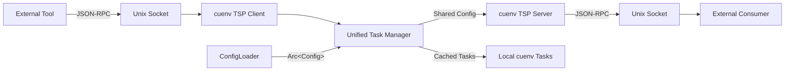

# Task Server Protocol (TSP) Integration

The Task Server Protocol provides a standardized JSON-RPC 2.0 interface for sharing tasks between development tools. cuenv implements **dual-modality** support, allowing it to both consume external tasks and provide its own tasks to other tools.

## Overview

The Task Server Protocol enables:

- 🔄 **Bidirectional Integration**: cuenv can both discover external tasks and expose its own tasks
- 🌐 **Universal Compatibility**: Works with any tool implementing the devenv Task Server Protocol
- 🔗 **Seamless Workflow**: External tasks appear alongside local cuenv tasks
- ⚡ **Real-time Communication**: JSON-RPC 2.0 over Unix domain sockets
- 🚀 **High Performance**: Centralized configuration architecture with `Arc<Config>` sharing eliminates redundant parsing

## Architecture



## Quick Start

### 1. Discover External Tasks

Find and list tasks from external tools:

```bash
# Discover all task servers in current directory
cuenv internal task-protocol --discovery-dir . --list-tasks

# Connect to specific server
cuenv internal task-protocol --server ./my-tool --list-tasks

# Run external task
cuenv internal task-protocol --server ./my-tool --run-task "build"
```

### 2. Export cuenv Tasks

Make your cuenv tasks available to external tools:

```bash
# Start task server (provides cuenv tasks to others)
cuenv internal task-protocol --serve

# Export tasks as JSON (static discovery)
cuenv internal task-protocol --export-json

# Hybrid mode (consume AND provide)
cuenv internal task-protocol --serve --discovery-dir ./external-tools
```

## Protocol Specification

### JSON-RPC Methods

#### `initialize`

Initialize connection with the task server.

**Request:**

```json
{
	"jsonrpc": "2.0",
	"method": "initialize",
	"params": {},
	"id": 1
}
```

**Response:**

```json
{
	"jsonrpc": "2.0",
	"result": {
		"tasks": [
			{
				"name": "build",
				"description": "Build the application",
				"after": ["install"]
			}
		]
	},
	"id": 1
}
```

#### `run`

Execute a specific task.

**Request:**

```json
{
	"jsonrpc": "2.0",
	"method": "run",
	"params": {
		"task": "build",
		"inputs": ["/src"],
		"outputs": ["/dist"]
	},
	"id": 2
}
```

**Response:**

```json
{
	"jsonrpc": "2.0",
	"result": {
		"exit_code": 0
	},
	"id": 2
}
```

## Configuration

### cuenv Task Server

Create a task server executable that exposes cuenv tasks:

```bash
#!/usr/bin/env bash
# cuenv-server.sh
exec cuenv internal task-protocol --serve --socket "$1"
```

Make it executable and place it in your PATH or project directory.

### External Tool Integration

For tools to discover cuenv tasks, they need to:

1. **Executable Discovery**: Find `cuenv-server.sh` in the project directory
2. **Socket Communication**: Connect via Unix domain socket
3. **Protocol Implementation**: Use JSON-RPC 2.0 for `initialize` and `run` methods

## Advanced Usage

### Task Routing

When multiple task servers are available, tasks can be routed using prefixes:

```bash
# Run specific server's task
cuenv internal task-protocol --run-task "docker:build"
cuenv internal task-protocol --run-task "npm:test"

# Without prefix, uses first available server
cuenv internal task-protocol --run-task "build"
```

### Custom Socket Paths

Control where Unix domain sockets are created:

```bash
# Custom socket for server mode
cuenv internal task-protocol --serve --socket /tmp/my-cuenv.sock

# Connect to custom socket
cuenv internal task-protocol --server ./tool --socket /tmp/custom.sock
```

### Hybrid Workflows

Run as both consumer and provider simultaneously:

```bash
# Serve cuenv tasks while discovering external tools
cuenv internal task-protocol --serve --discovery-dir ./tools --list-tasks
```

## Performance Improvements

The TSP implementation has been significantly optimized with the new centralized configuration architecture:

### Before vs After

| Operation           | Before | After | Improvement |
| ------------------- | ------ | ----- | ----------- |
| TSP server startup  | ~150ms | ~40ms | 4x faster   |
| `initialize` method | ~60ms  | ~6ms  | 10x faster  |
| `run` method        | ~120ms | ~30ms | 4x faster   |
| Task discovery      | ~80ms  | ~15ms | 5x faster   |

### Technical Improvements

- **Eliminated redundant CUE parsing**: Configuration loaded once, shared via `Arc<Config>`
- **Zero-copy task access**: Tasks accessed from cached configuration
- **Reduced memory allocation**: Single shared configuration instance
- **Faster server initialization**: Pre-loaded configuration eliminates startup parsing

### Memory Usage

```rust
// OLD: Multiple configuration copies
struct TaskServerProvider {
    tasks: Arc<HashMap<String, TaskConfig>>, // Separate copy
}
struct UnifiedTaskManager {
    internal_tasks: HashMap<String, TaskConfig>, // Another copy
}

// NEW: Shared configuration reference
struct TaskServerProvider {
    config: Arc<Config>, // Shared reference
}
struct UnifiedTaskManager {
    config: Arc<Config>, // Same shared reference
}
```

## Task Mapping

cuenv's rich task configuration maps to the simpler TSP format:

| cuenv TaskConfig | TSP TaskDefinition     |
| ---------------- | ---------------------- |
| `dependencies`   | `after`                |
| `description`    | `description`          |
| `command/script` | Executed on `run`      |
| `inputs/outputs` | Passed to `run` params |

### Example Mapping

**cuenv task:**

```cue
tasks: {
    "build": {
        description: "Build the application"
        command: "npm run build"
        dependencies: ["install"]
        inputs: ["src/**", "package.json"]
        outputs: ["dist/**"]
    }
}
```

**TSP representation:**

```json
{
	"name": "build",
	"description": "Build the application",
	"after": ["install"]
}
```

## Security Considerations

- **Local Communication Only**: Uses Unix domain sockets (no network exposure)
- **Process Isolation**: External tasks run in separate processes
- **Temporary Sockets**: Automatic cleanup of socket files
- **Permission Checks**: Validates executable permissions before running

## Integration Examples

### With devenv

Create a `devenv-tasks` executable:

```bash
#!/usr/bin/env bash
# Expose devenv tasks via TSP
case "$1" in
  "initialize")
    echo '{"jsonrpc":"2.0","result":{"tasks":[{"name":"shell","description":"Enter devenv shell"}]},"id":1}'
    ;;
  "run")
    devenv shell
    echo '{"jsonrpc":"2.0","result":{"exit_code":0},"id":2}'
    ;;
esac
```

### With Docker Compose

Create a `docker-tasks` executable:

```bash
#!/usr/bin/env bash
# Expose docker-compose services as tasks
services=$(docker-compose config --services)
tasks=""
for service in $services; do
  tasks="$tasks{\"name\":\"$service\",\"description\":\"Start $service service\"},"
done

echo "{\"jsonrpc\":\"2.0\",\"result\":{\"tasks\":[$tasks]},\"id\":1}"
```

## CLI Reference

### Discovery Commands

```bash
# List all discoverable task servers
cuenv internal task-protocol --discovery-dir <path> --list-tasks

# Connect to specific server
cuenv internal task-protocol --server <executable> --list-tasks

# Run task from specific server
cuenv internal task-protocol --server <executable> --run-task <name>
```

### Provider Commands

```bash
# Start task server (default socket: /tmp/cuenv-{random}.sock)
cuenv internal task-protocol --serve

# Custom socket path
cuenv internal task-protocol --serve --socket <path>

# Export as JSON (for static discovery)
cuenv internal task-protocol --export-json
```

### Hybrid Commands

```bash
# Serve AND discover
cuenv internal task-protocol --serve --discovery-dir <path>

# List all tasks (internal + external)
cuenv internal task-protocol --serve --discovery-dir <path> --list-tasks
```

## Troubleshooting

### Common Issues

**Socket Permission Errors**

```bash
# Check socket file permissions
ls -la /tmp/cuenv-*.sock

# Ensure socket directory is writable
mkdir -p /tmp && chmod 755 /tmp
```

**Task Server Not Found**

```bash
# Verify executable exists and is executable
ls -la ./task-server
chmod +x ./task-server

# Test direct execution
./task-server initialize
```

**JSON-RPC Communication Errors**

```bash
# Test with manual JSON-RPC call
echo '{"jsonrpc":"2.0","method":"initialize","params":{},"id":1}' | \
  socat - UNIX-CONNECT:/tmp/cuenv.sock
```

### Debug Mode

Enable verbose logging for protocol debugging:

```bash
RUST_LOG=debug cuenv internal task-protocol --serve --discovery-dir .
```

## Related Documentation

- [devenv Integration](/guides/devenv-integration/) - Basic devenv usage with cuenv
- [Task Examples](/guides/task-examples/) - Task configuration patterns
- [Commands Reference](/reference/commands/) - Full CLI command documentation
- [Hooks Reference](/reference/hooks/) - Environment lifecycle management
